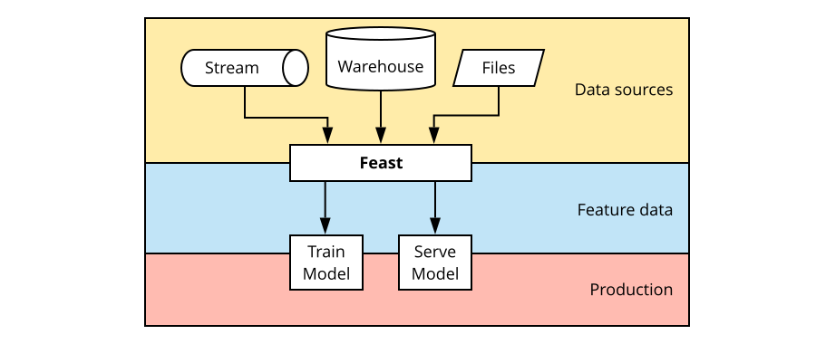

# Feast - Feature Store for Machine Learning

<p style='border: 1px solid red; border-radius: 0.5rem; background-color: #ffd699; padding: 0.6rem;'>Note: This repo is a fork of <a href="https://github.com/gojek/feast">github.com/gojek/feast</a>.</p>

## Farfetch Section

### How-to: Build locally

This project runs on CI for all commits (on all branches) and creates artifacts based on the commit hash.
Using Cloud Build locally is generally not however, it can be useful if debugging the `cloudbuild.yaml`.

Install the required dependencies: https://cloud.google.com/cloud-build/docs/build-debug-locally

```bash
cloud-build-local --config=cloudbuild.yaml --dryrun=false --substitutions SHORT_SHA=$(git rev-parse --short HEAD) .
```

### How-to: Build single step locally

Some steps can be build directly on your own machine - follow the commands that `cloudbuild.yaml` is invoking.

If you do not have the required dependencies, you can translate the `cloudbuild.yaml` step into a Docker command. E.g.:

```bash
docker run --rm --name feast-build \
    -v $(pwd):/workspace \
    -v go_cache:/cache/go \
    -v m2_cache:/cache/m2 \
    -w /workspace/protos \
    -e GO111MODULE=on \
    -e GOPATH=/cache/go \
    -e MAVEN_OPTS=-Dmaven.repo.local=/cache/m2 \
    -e FEAST_VERSION=ff-$(git rev-parse --short HEAD)-dev \
    --entrypoint make \
    gcr.io/konnekt-core/protoc-go:3.6.1 \
    gen-go
```

```bash
docker run --rm --name feast-build \
    -v $(pwd):/workspace \
    -v go_cache:/cache/go \
    -v m2_cache:/cache/m2 \
    -w /workspace \
    -e GO111MODULE=on \
    -e GOPATH=/cache/go \
    -e MAVEN_OPTS=-Dmaven.repo.local=/cache/m2 \
    -e FEAST_VERSION=ff-$(git rev-parse --short HEAD) \
    --entrypoint mvn -- \
    maven:3.6.2-jdk-11-slim \
    -Drevision=ff-$(git rev-parse --short HEAD) \
    -Dtestbucket=dev-konnekt-data-deep-1-feast-tmp \
    test
```

```bash
docker run --rm --name feast-build \
    -v $(pwd):/workspace \
    -v $(pwd)/tmp/go_cache:/cache/go \
    -v $(pwd)/tmp/m2_cache:/cache/m2 \
    -v $(pwd)/tmp/pip_cache:/root/.cache/pip \
    -v $(pwd)/tmp/logs:/log \
    -w /workspace/sdk/python \
    -e GO111MODULE=on \
    -e GOPATH=/cache/go \
    -e MAVEN_OPTS=-Dmaven.repo.local=/cache/m2 \
    -e FEAST_VERSION=ff-$(git rev-parse --short HEAD) \
    --entrypoint sh -- \
    python:3.7-buster \
    -c 'pip install -r requirements-ci.txt && pip install -e . && pytest --junitxml=/log/python-sdk-test-report.xml'
```

### How-to: Run locally

```bash
mvn --projects core,ingestion -Drevision=dev -DskipTests=true --batch-mode package
docker-compose up --build
```

### How-to: Run locally in IDE

```bash
docker run --rm --name postgresql \
    -e POSTGRESQL_USERNAME=postgres \
    -e POSTGRESQL_PASSWORD=password \
    -e POSTGRESQL_DATABASE=postgres \
    -p 5432:5432 \
    bitnami/postgresql:11.5.0-debian-9-r84
```

```text
LOG_TYPE=JSON;PROJECT_ID=dev-konnekt-data-deep-1;TRAINING_DATASET_PREFIX=feast_training;JOB_RUNNER=DataflowRunner;JOB_WORKSPACE=gs://dev-konnekt-data-deep-1-dataflow-workspace;JOB_OPTIONS={};STORE_SERVING_TYPE=noop;STORE_SERVING_OPTIONS={};STORE_WAREHOUSE_TYPE=bigquery;STORE_WAREHOUSE_OPTIONS={"project": "dev-konnekt-data-deep-1", "dataset": "feast_warehouse"};STORE_ERRORS_TYPE=stdout;STORE_ERRORS_OPTIONS=;DATAFLOW_PROJECT_ID=dev-konnekt-data-deep-1;DATAFLOW_LOCATION=europe-west4
```

### Forward ports to run locally

```bash
kubectl port-forward -n deep svc/feast-postgresql-postgresql 5432:5432
kubectl port-forward -n deep svc/feast-redis-jobstore-headless 6379:6379
kubectl port-forward -n deep svc/feast-feast-core 6565:6565
```

## Overview

Feast (Feature Store) is a tool for managing and serving machine learning features. Feast is the bridge between models and data.

Feast aims to:
* Provide a unified means of managing feature data from a single person to large enterprises.
* Provide scalable and performant access to feature data when training and serving models.
* Provide consistent and point-in-time correct access to feature data.
* Enable discovery, documentation, and insights into your features.



TL;DR: Feast decouples feature engineering from feature usage. Features that are added to Feast become available immediately for training and serving. Models can retrieve the same features used in training from a low latency online store in production.
This means that new ML projects start with a process of feature selection from a catalog instead of having to do feature engineering from scratch.

```
# Setting things up
fs = feast.Client('feast.example.com')
customer_features = ['CreditScore', 'Balance', 'Age', 'NumOfProducts', 'IsActive']

# Training your model (typically from a notebook or pipeline)
data = fs.get_batch_features(customer_features, customer_entities)
my_model = ml.fit(data)

# Serving predictions (when serving the model in production)
prediction = my_model.predict(fs.get_online_features(customer_features, customer_entities))
```

## Important resources

Please refer to the official docs at <https://feast.dev>

 * [Why Feast?](https://docs.feast.dev/why-feast)
 * [Concepts](https://docs.feast.dev/concepts)
 * [Installation](https://docs.feast.dev/getting-started/installing-feast)
 * [Getting Help](https://docs.feast.dev/getting-help)
 * [Example Notebook](https://github.com/gojek/feast/blob/master/examples/basic/basic.ipynb)

## Notice

Feast is a community project and is still under active development. Your feedback and contributions are important to us. Please have a look at our [contributing guide](docs/contributing.md) for details.
